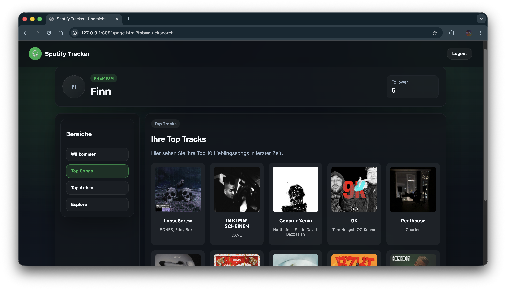
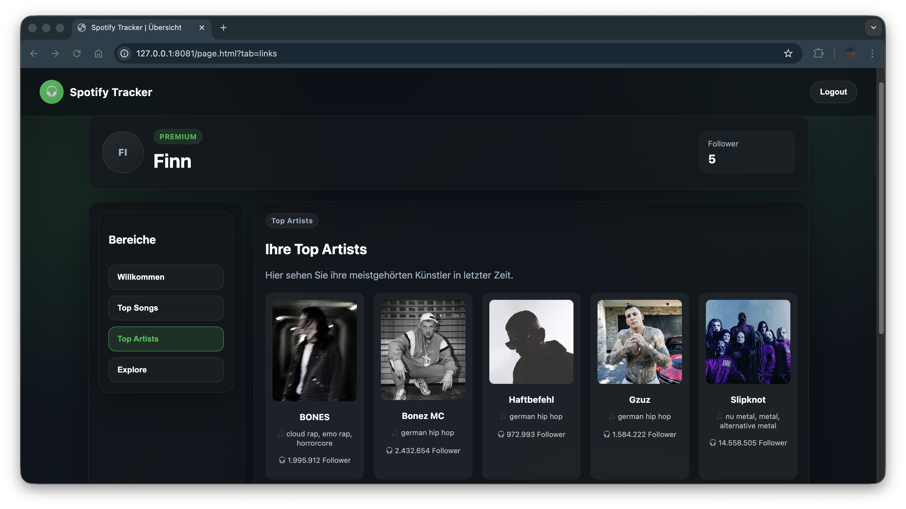
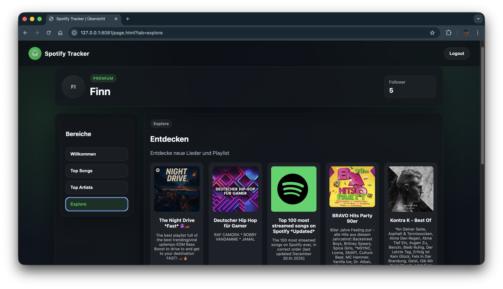

# Spotify-Stats

## Tabs

<details>
  <summary>Zusammenfassung</summary>

### Überblick

Spotify-Stats ist eine Webanwendung zur Analyse und Visualisierung persönlicher Spotify-Hörgewohnheiten.
Nach der Anmeldung mit einem Spotify-Account zeigt das Dashboard unter anderem die meistgehörten Songs,
Lieblings-Artists sowie weitere musikbezogene Statistiken an.

Zusätzlich bietet die Anwendung eine Übersicht über aktuell populäre Playlists, um globale Musiktrends
zu entdecken und neue Inhalte kennenzulernen.

Ziel des Projekts ist es, ein eigenes, dauerhaft verfügbares „Spotify Wrapped“-ähnliches Erlebnis zu schaffen,
das persönliche Auswertungen mit globalen Musiktrends kombiniert.

### Technische Details

- Spotify Web API + OAuth-Authentifizierung mit Refresh-Token-Handling
- JWT für die Anwendungssitzung, Flyway für Datenbank-Migrationen
- Swagger UI zur Exploration und Dokumentation der REST-API
- Jib für Container-Builds im CI (ohne Dockerfile), GitHub Actions für Tests/Builds
- Automatisches Publish bei Push auf `main` ins Docker-Repository:
  <https://hub.docker.com/r/rijas144/spotify-stats/tags>


### Features

**Top-Songs:** zeigt die meistgehörten Songs.



**Top-Artists:** Übersicht der Lieblings-Artists.



**Explore:** aktuelle, globale Playlists zum Entdecken neuer Musik.


</details>

<details>
  <summary>Locale Installation</summary>

Die App ist für Cloud-Deployments gedacht, lässt sich aber auch lokal mit Docker Compose starten.

### Voraussetzungen
- Docker + Docker Compose

### 1) `.env` Datei anlegen
Lege im Projekt-Root eine `.env` Datei mit den benötigten Variablen an:

  ```
  DB_HOST=mysql
  DB_PORT=3306
  DB_NAME=spotify_tracker
  DB_USER=spotify_user
  DB_PASSWORD=spotify_password

  MYSQL_DATABASE=spotify_tracker
  MYSQL_USER=spotify_user
  MYSQL_PASSWORD=spotify_password
  MYSQL_ROOT_PASSWORD=spotify_root_password

  SERVER_PORT=8080
  SERVER_ADDRESS=0.0.0.0

  APP_CRYPTO_PASSWORD=please-change-me
  APP_CRYPTO_SALT=deadbeefcafebabe

  APP_JWT_SECRET=please-change-me-32-chars-minimum

  SPOTIFY_CLIENT_ID=your_spotify_client_id
  SPOTIFY_CLIENT_SECRET=your_spotify_client_secret
  SPOTIFY_SCOPES=user-read-email,user-read-private,user-top-read
  SPOTIFY_REDIRECT_URI=http://localhost:8080/api/spotify/callback
  ```

> Hinweis: `APP_JWT_SECRET` muss mindestens 32 Zeichen lang sein.

### 2) Compose starten
  ```
  docker compose up --build
  ```

Die App ist danach unter `http://127.0.0.1:8080` erreichbar.

#### Fehlerbehebung: `ERR_EMPTY_RESPONSE`
Wenn der Browser `Diese Seite funktioniert nicht (ERR_EMPTY_RESPONSE)` zeigt, läuft der App-Container meist nicht
oder ist noch nicht bereit. Prüfe den Status und Logs:

  ```
  docker compose ps
  docker compose logs -f app
  docker compose logs -f mysql
  ```

Häufige Ursachen:
- Die `.env` Variablen fehlen oder sind falsch (z. B. `DB_*`, `APP_JWT_SECRET`, Spotify OAuth Werte).
- MySQL ist noch nicht gesund; warte, bis der `mysql`-Service im `healthy`-Status ist.
- Port `8080` ist belegt → `SERVER_PORT` in der `.env` ändern.

### 3) Compose beenden
  ```
  docker compose down
  ```
</details>

<details>
  <summary>Cloud Deployment</summary>

Siehe die Kubernetes-Anleitung in [`k8s/README.md`](k8s/README.md).
</details>